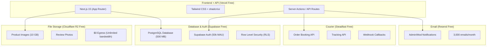
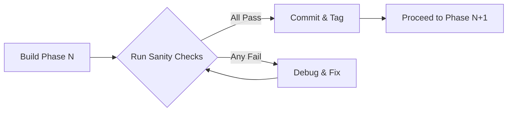
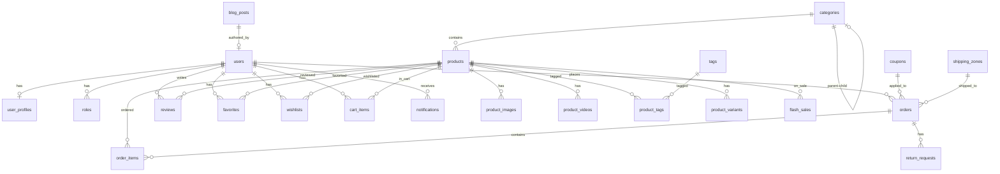
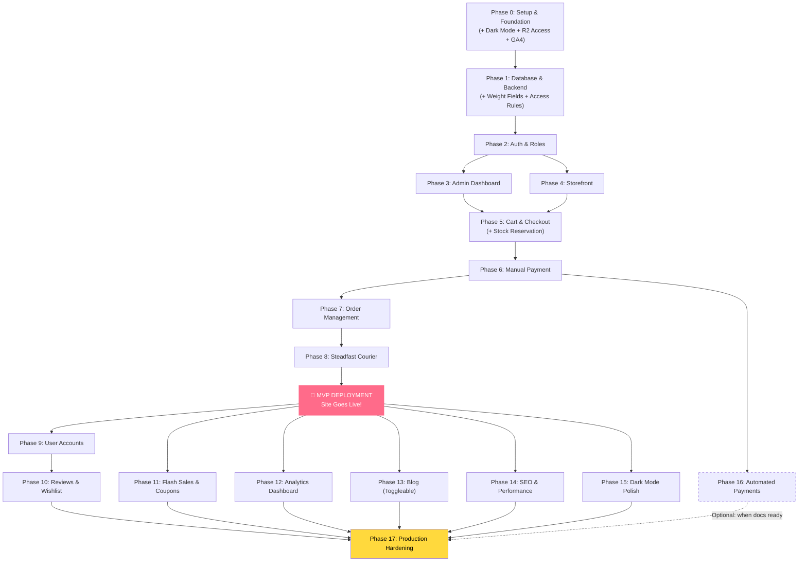

# 🍒 CherrySo — Master Build & Deployment Plan

> **E-commerce website for a women-focused accessories shop, with a Sanrio-inspired kawaii theme, built and hosted at zero cost.**

---

## Table of Contents

1. [Project Overview](#1-project-overview)
2. [Tech Stack & Architecture](#2-tech-stack--architecture)
3. [Free Tier Limits & Constraints](#3-free-tier-limits--constraints)
4. [Modular Build Phases](#4-modular-build-phases)
   - [Phase 0: Project Setup & Foundation](#phase-0-project-setup--foundation)
   - [Phase 1: Database Schema & Backend Core](#phase-1-database-schema--backend-core)
   - [Phase 2: Authentication & Role System](#phase-2-authentication--role-system)
   - [Phase 3: Admin Dashboard — Core](#phase-3-admin-dashboard--core)
   - [Phase 4: Storefront — Product Browsing](#phase-4-storefront--product-browsing)
   - [Phase 5: Cart & Guest Checkout](#phase-5-cart--guest-checkout)
   - [Phase 6: Manual Payment System](#phase-6-manual-payment-system)
   - [Phase 7: Order Management & Invoicing](#phase-7-order-management--invoicing)
   - [Phase 8: Courier Integration (Steadfast)](#phase-8-courier-integration-steadfast)
   - [🚀 MVP Deployment Checkpoint](#-mvp-deployment-checkpoint--deploy-after-phase-8)
   - [Phase 9: User Accounts & Profiles](#phase-9-user-accounts--profiles)
   - [Phase 10: Reviews, Favorites & Wishlist](#phase-10-reviews-favorites--wishlist)
   - [Phase 11: Flash Sales, Coupons & Discounts](#phase-11-flash-sales-coupons--discounts)
   - [Phase 12: Analytics Dashboard](#phase-12-analytics-dashboard)
   - [Phase 13: Blog Module (Toggleable)](#phase-13-blog-module-toggleable)
   - [Phase 14: SEO & Performance Optimization](#phase-14-seo--performance-optimization)
   - [Phase 15: Dark Mode — Polish & QA Pass](#phase-15-dark-mode--polish--qa-pass)
   - [Phase 16: Automated Payment Gateways (bKash PGW + Visa)](#phase-16-automated-payment-gateways-bkash-pgw--visa)
   - [Phase 17: Production Hardening & Full Feature Launch](#phase-17-production-hardening--full-feature-launch)
5. [Sanity Checks & Quality Gates](#5-sanity-checks--quality-gates)
6. [Database Schema Overview](#6-database-schema-overview)
7. [Folder Structure](#7-folder-structure)
8. [Risk Register & Mitigations](#8-risk-register--mitigations)
9. [Legal Considerations](#9-legal-considerations)
10. [Vibe-Coding Agent Instructions](#10-vibe-coding-agent-instructions)

---

## 1. Project Overview

| Attribute | Detail |
| :--- | :--- |
| **Project Name** | CherrySo |
| **Type** | E-commerce Website |
| **Target Audience** | Women (Bangladesh-based, BDT currency) |
| **Products** | Ornaments, bags, gifts, mystery boxes, jewellery, phone covers, clips, etc. |
| **Language** | English |
| **Currency** | BDT (৳) |
| **Theme** | Sanrio-inspired kawaii (Hello Kitty, My Melody, Cinnamoroll, Kuromi aesthetic) |
| **Budget** | Zero cost (free subdomain, free hosting, free database) |
| **Existing Presence** | Facebook (page + group) & Instagram |

### Stakeholders

| Role | Permissions |
| :--- | :--- |
| **Admin** | Full access: manage products, categories, tags, inventory, orders, reviews, comments, media, blog, coupons, flash sales, analytics. Can add/modify/remove moderators. |
| **Moderator** | Same as admin EXCEPT: cannot change or configure admins or other moderators. |
| **Registered Customer** | Browse, search, cart, checkout (pre-filled from profile), wishlist (out-of-stock items), favorites, post reviews (for purchased products), order history, order tracking. |
| **Guest Customer** | Browse, search, cart, checkout (fill form manually). No wishlist, favorites, or reviews. |

---

## 2. Tech Stack & Architecture

### The "Zero-Cost Supabase Hybrid" Stack



### Service Breakdown

| Layer | Service | Free Tier Limits | Why Chosen |
| :--- | :--- | :--- | :--- |
| **Framework** | Next.js 15 (App Router) | N/A (open source) | Best vibe-coding support, SSR/SSG, API routes, Vercel-native |
| **UI Library** | Tailwind CSS + shadcn/ui | N/A (open source) | Highly customizable for kawaii theme, component library |
| **Hosting** | Vercel (Hobby Plan) | 100 GB bandwidth/mo, serverless functions, edge | Best Next.js hosting, generous free tier |
| **Database** | Supabase (PostgreSQL) | 500 MB DB, 50k MAU auth, 500k edge function invocations | Postgres with RLS, built-in auth, dashboard |
| **File Storage** | Cloudflare R2 | 10 GB storage, **$0 egress**, 1M Class A ops/mo, 10M Class B ops/mo | Zero bandwidth cost = images never get throttled |
| **Image Optimization** | Next.js `<Image />` + Cloudflare | Built into Next.js | Auto WebP, responsive sizes, lazy loading |
| **Email** | Resend | 3,000 emails/month, 100/day | Admin/mod notification emails |
| **Courier** | Steadfast Courier API | Free API, free merchant registration | Simple integration, webhook support |
| **ORM** | Drizzle ORM | N/A (open source) | Type-safe, lightweight, excellent Supabase/Postgres support |
| **Validation** | Zod | N/A (open source) | Runtime type validation for forms and API |
| **State Management** | Zustand (for cart) | N/A (open source) | Lightweight client-side state for cart persistence |
| **Testing** | Vitest + MSW | N/A (open source) | Fast test runner with API mocking for critical business logic |
| **Rate Limiting** | Upstash Ratelimit + Redis | Free: 10,000 requests/day | Protect critical endpoints from abuse (orders, coupons, search) |
| **Data Fetching** | @tanstack/react-query | N/A (open source) | Client-side caching, optimistic updates, automatic revalidation for cart/favorites/notifications |
| **Toast/Notifications** | sonner | N/A (open source) | Lightweight toast library for user feedback (errors, success messages, non-critical alerts) |
| **Keep-Alive** | cron-job.org | Free | Ping Supabase every 4 days to prevent 7-day pause |

> [!IMPORTANT]
> **Why NOT use Supabase Storage for images?** Supabase free tier only gives 1 GB storage and 5 GB/month bandwidth. An e-commerce site with 300+ product images would exhaust this within days and return `402 Payment Required` errors, taking the store down. Cloudflare R2 gives 10 GB storage with **zero egress fees** — images will never be throttled regardless of traffic.

---

## 3. Free Tier Limits & Constraints

### Hard Limits to Monitor

| Resource | Limit | What Happens When Exceeded | Monitoring Strategy |
| :--- | :--- | :--- | :--- |
| Supabase DB | 500 MB | Read-only mode (no writes) | Admin dashboard shows DB size; alert at 400 MB |
| Cloudflare R2 Storage | 10 GB | Charges begin ($0.015/GB/mo) | Track via R2 dashboard; compress images before upload |
| Vercel Bandwidth | 100 GB/mo | Site goes offline until next month | Vercel dashboard; optimize images aggressively |
| Resend Emails | 100/day, 3,000/mo | Emails stop sending | Admin dashboard counter; batch notifications |
| Supabase Auth | 50,000 MAU | New signups blocked | Monitor in Supabase dashboard |
| Supabase Inactivity | 7 days no queries | Project pauses (cold boot) | cron-job.org pings every 4 days |

### Mitigation Strategies

- **Image Compression:** All product images compressed to WebP format, max 200KB per image, via client-side compression before upload.
- **Thumbnail Generation:** Generate 3 sizes on upload (thumbnail 150px, medium 600px, large 1200px) to serve appropriate sizes.
- **Lazy Loading:** All images below the fold use lazy loading.
- **Database Pruning:** Archive old completed orders after 6 months to keep DB lean.
- **CDN Caching:** Cloudflare R2 serves images with aggressive cache headers (1 year for immutable assets).

---

## 4. Modular Build Phases

> [!CAUTION]
> **🤖 VIBE-CODING AGENTS: READ THIS BEFORE WRITING ANY CODE**
>
> 1. **Read the ENTIRE phase** you're about to build before starting. Do not start coding from just the title.
> 2. **Read `DATA_ACCESS_RULES.md`** before writing any database query. Use Supabase Client for user-facing code, Drizzle for admin/server code.
> 3. **Use CSS custom properties** for ALL colors — never hardcode hex values. Dark mode must work on every component you build.
> 4. **After completing each phase, you MUST run the checkpoint procedure** (see below) before moving to the next phase. NO EXCEPTIONS.
> 5. **If a sanity check fails, do NOT proceed.** Debug and fix first. Cascading errors across phases are extremely expensive.
> 6. **Check previous phase features still work** after each phase. Run `npm run build && npm run test` before committing.

### 📌 Mandatory Checkpoint Procedure (After EVERY Phase)

**Run this exact sequence after completing each phase. Do not skip any step.**

```bash
# Step 1: Verify the build compiles cleanly
npm run build

# Step 2: Run all tests (must pass 100%)
npm run test

# Step 3: Run linter
npm run lint

# Step 4: Start dev server and manually verify
npm run dev
# → Open browser, test the sanity check items for this phase
# → Also quick-test features from ALL previous phases (regression check)

# Step 5: Git checkpoint — commit and tag
git add -A
git commit -m "Phase N: [Phase Title] — complete, sanity check passed"
git tag phase-N-complete

# Step 6: STOP and review before proceeding
# → List what was built
# → List any issues encountered and how they were resolved
# → Confirm all sanity checks passed
# → Only then proceed to Phase N+1
```

> [!IMPORTANT]
> **Git tags are your rollback safety net.** If Phase N+1 breaks something, you can `git reset --hard phase-N-complete` to get back to a known-good state. Never skip tagging.

---

### Phase 0: Project Setup & Foundation

**Goal:** Initialize the project with all tooling, dependencies, and the Sanrio-inspired theme system.

#### Tasks

1. **Initialize Next.js 15 project** with App Router, TypeScript, Tailwind CSS, ESLint
2. **Install and configure core dependencies:**
   - `drizzle-orm` + `drizzle-kit` (ORM + migrations)
   - `@supabase/supabase-js` + `@supabase/ssr` (Supabase client)
   - `aws-sdk` or `@aws-sdk/client-s3` (for Cloudflare R2, S3-compatible)
   - `zod` (validation)
   - `zustand` (client-side cart state)
   - `shadcn/ui` (component library)
   - `lucide-react` (icons)
   - `next-themes` (dark mode prep)
   - `vitest` + `@testing-library/react` + `@testing-library/jest-dom` (testing)
   - `msw` (Mock Service Worker — for mocking API calls in tests)
   - `@tanstack/react-query` (client-side data fetching, caching, optimistic updates)
   - `sonner` (toast notifications for user feedback)
3. **Set up environment variables structure** (`.env.local.example`)
4. **Create the Sanrio-inspired design system:**
   - **Color Palette:**
     - Primary Pink: `#FF6B8A` (Hello Kitty inspired)
     - Secondary Lavender: `#B48EF0` (Kuromi inspired)
     - Accent Yellow: `#FFD93D` (Cinnamoroll inspired)
     - Soft Blue: `#87CEEB` (My Melody bow)
     - Background: `#FFF5F7` (light mode) / `#1A1A2E` (dark mode)
     - Card Background: `#FFFFFF` / `#2D2D44`
   - **Typography:** Rounded, soft fonts (e.g., Nunito, Quicksand from Google Fonts)
   - **Border Radius:** Generous rounding (16px default for cards)
   - **Custom Decorative Elements:** Bow motifs, paw prints, star accents (CSS/SVG, not copyrighted images)
   - **Sanrio Character Usage:** Small decorative illustrations with proper credit in footer
5. **Set up the base layout:**
   - Responsive navbar with logo, search, cart icon, auth buttons
   - Footer with social media links (Facebook, Instagram), Sanrio credits, contact info
   - Mobile-responsive hamburger menu
6. **Set up dark mode foundation (build once, not retrofit):**
   - Install and configure `next-themes` with `ThemeProvider` in root layout
   - Define **all** color tokens as CSS custom properties (not hardcoded hex values):
     ```css
     :root { --background: #FFF5F7; --card: #FFFFFF; --primary: #FF6B8A; ... }
     .dark { --background: #1A1A2E; --card: #2D2D44; --primary: #FF8FAB; ... }
     ```
   - Configure Tailwind to use CSS variables: `background: 'hsl(var(--background))'`
   - Add theme toggle button (sun/moon icon) in navbar from the start
   - Every component built from this point forward automatically supports both modes
   - **This prevents the Phase 15 retrofit problem** — dark mode is tested as you build, not bolted on after 14 phases
7. **Create Supabase project** (free tier)
8. **Create Cloudflare R2 bucket** (free tier) **+ set up public access:**
   - R2 buckets are **private by default** — images won't load without public access
   - **Development:** Enable the free `r2.dev` public subdomain in R2 dashboard (rate-limited, not for production)
   - **Production:** Create a Cloudflare Worker to serve R2 objects publicly with cache headers:
     - Free tier: 100,000 requests/day (sufficient for a small-medium store)
     - Set `Cache-Control: public, max-age=31536000, immutable` for product images
     - Restrict CORS to your Vercel domain
   - Store the public base URL in env var: `NEXT_PUBLIC_R2_PUBLIC_URL`
   - All image URLs in the database will be relative paths; the full URL is constructed as `${R2_PUBLIC_URL}/${relative_path}`
9. **Set up Resend account** (free tier)
10. **Add Google Analytics 4** (free, unlimited):
    - Create GA4 property at analytics.google.com
    - Add GA4 script to root layout (via `next/script`)
    - Track page views automatically
    - This provides visitor analytics from day 1 (traffic sources, devices, pages) while the custom analytics dashboard (Phase 12) is built later
11. **Initialize Git repository** with `.gitignore`, proper branching strategy
12. **Set up global error handling infrastructure:**
    - Create kawaii-themed `error.tsx` (App Router error boundary) with a cute illustration + "Something went wrong" message + retry button
    - Create kawaii-themed `not-found.tsx` (404 page) with a matching illustration
    - Set up `sonner` `<Toaster />` in root layout for non-critical error feedback:
      - Success toasts: "Added to cart!", "Review submitted!"
      - Error toasts: "Failed to add to favorites, please try again"
      - Loading toasts: "Placing your order..."
    - Create a shared `lib/errors.ts` utility:
      - `AppError` class with error codes and user-friendly messages
      - `handleApiError()` function that maps API errors (Supabase down, R2 down, Steadfast down, network errors) to user-friendly toast messages
      - **Never** show raw error stacks or technical messages to customers
    - Implement graceful degradation patterns:
      - If R2 is unreachable → show placeholder product images (not broken image icons)
      - If Supabase is slow → show skeleton states with timeout, then friendly error
      - If Steadfast API is down → queue order for retry, show "Shipping info will be updated shortly"
    - Leverage Vercel's built-in error logging (free) for production monitoring — errors are automatically captured in Vercel dashboard
13. **Set up data fetching layer:**
    - Configure `QueryClientProvider` (React Query) in root layout with sensible defaults:
      - `staleTime: 5 * 60 * 1000` (5 min) for product data
      - `gcTime: 30 * 60 * 1000` (30 min) garbage collection
      - `retry: 2` for failed queries
    - Define server-side caching strategy using Next.js App Router:
      - Product pages: ISR with `revalidate: 3600` (1 hour) — data doesn't change often
      - Category pages: ISR with `revalidate: 1800` (30 min)
      - Homepage: ISR with `revalidate: 900` (15 min) — shows new arrivals
      - Cart/checkout: No caching (always fresh)
      - Admin pages: No caching (always fresh)
    - Use `revalidateTag()` / `revalidatePath()` in admin mutations to bust cache when products/categories are updated
    - Set up React Query hooks pattern for client-side interactive features:
      - Optimistic updates for "Add to Cart", "Add to Favorites", "Remove from Cart" (instant UI feedback)
      - Background revalidation for cart item stock checks
      - Mutation hooks with rollback on failure

#### Deliverables
- Running Next.js app with the kawaii theme applied
- All services connected (Supabase, R2, Resend)
- Design system tokens in Tailwind config
- Error handling infrastructure (error boundaries, toast system, graceful degradation utilities)
- Data fetching layer (React Query provider, caching strategy, optimistic update patterns)

#### Sanity Check
- [ ] `npm run dev` starts without errors
- [ ] Theme colors and fonts render correctly
- [ ] **Dark mode toggle works** — switching between light/dark/system renders correct colors
- [ ] **No hardcoded hex colors** — all colors use CSS custom properties
- [ ] Supabase connection test query succeeds
- [ ] **R2 public access works** — upload a test image, access it via the public URL in a browser
- [ ] All env vars documented in `.env.local.example`
- [ ] Mobile responsive layout renders on 375px, 768px, 1024px, 1440px viewports
- [ ] GA4 tracking script loads and records a page view in the GA4 real-time dashboard
- [ ] **Error boundary works:** Throw a test error → kawaii error page renders (not a blank screen)
- [ ] **404 page works:** Navigate to `/nonexistent` → kawaii 404 page renders
- [ ] **Toast system works:** Trigger a test toast → appears with correct styling in both light/dark mode
- [ ] **React Query provider works:** Wrap a test component → no console errors
- [ ] **Vitest runs:** `npm run test` executes (even if no tests yet, the runner must work)
- [ ] **Run checkpoint procedure:** `npm run build && npm run lint` → all pass → `git tag phase-0-complete`

---

### Phase 1: Database Schema & Backend Core

**Goal:** Design and deploy the complete database schema with Drizzle ORM and RLS policies.

#### Tasks

1. **Define Drizzle schema files** (see [Section 6](#6-database-schema-overview) for full schema):
   - `users` (extends Supabase auth.users)
   - `user_profiles` (name, phone, address, avatar)
   - `roles` (admin, moderator — links to users)
   - `categories` (hierarchical — parent/child)
   - `tags`
   - `products` (name, slug, description, price, compare_at_price, sku, stock, **weight_grams**, status, category_id, **search_vector**)
   - `product_images` (product_id, url, alt_text, position, is_primary)
   - `product_videos` (product_id, url, thumbnail_url)
   - `product_tags` (many-to-many: product ↔ tag)
   - `product_variants` (size, color, price_override, stock, **weight_grams**)
   - `cart_items` (user_id — authenticated users only; guests use localStorage, not DB)
   - `orders` (order_number, status, customer info, shipping info, payment info, totals)
   - `order_items` (order_id, product_id, variant_id, quantity, price_at_purchase)
   - `reviews` (user_id, product_id, rating, text, images, is_verified_purchase)
   - `favorites` (user_id, product_id)
   - `wishlists` (user_id, product_id — only for out-of-stock items)
   - `coupons` (code, type, value, min_order, max_uses, expiry)
   - `flash_sales` (product_id, sale_price, starts_at, ends_at)
   - `blog_posts` (title, slug, content, author_id, status, published_at)
   - `shipping_zones` (zone_name, base_rate, per_kg_rate)
   - `site_settings` (key-value for toggleable features like blog)
   - `notifications` (user_id, type, message, read, data)
   - `audit_log` (who did what, when — for admin actions)
   - `return_requests` (order_id, user_id, reason, status, refund_amount, admin_notes, resolved_at)

2. **Set up Drizzle migrations** and run initial migration against Supabase
3. **Configure Row Level Security (RLS)** policies:
   - Products/Categories/Tags: Public read, admin/mod write
   - Orders: Users can read their own, admin/mod can read all
   - User profiles: Users can read/update their own, admin/mod can read all
   - Reviews: Public read, authenticated users can create (for purchased products), admin/mod can moderate
   - Admin operations: Only users with admin/moderator role
4. **Create shared utility functions:**
   - `db.ts` — Drizzle database client
   - `auth.ts` — Supabase auth helpers (server/client)
   - `r2.ts` — Cloudflare R2 upload/delete helpers
   - `validators.ts` — Zod schemas for all entities
   - `errors.ts` — Import and use the error handling utilities from Phase 0

5. **Set up PostgreSQL full-text search** (foundation for Phase 4 search feature):

   > ⚠️ **PostgreSQL full-text search doesn't work out of the box.** Without this setup, the search bar in Phase 4 will either not work, be extremely slow, or return irrelevant results.

   - Add a `search_vector TSVECTOR` generated column to `products` table:
     ```sql
     ALTER TABLE products ADD COLUMN search_vector tsvector
       GENERATED ALWAYS AS (
         setweight(to_tsvector('english', coalesce(name, '')), 'A') ||
         setweight(to_tsvector('english', coalesce(description, '')), 'B')
       ) STORED;
     ```
   - Create a **GIN index** on the `search_vector` column for fast lookup:
     ```sql
     CREATE INDEX idx_products_search ON products USING GIN (search_vector);
     ```
   - Create a helper SQL function for search queries that also matches tags and categories:
     ```sql
     CREATE OR REPLACE FUNCTION search_products(search_query text)
     RETURNS SETOF products AS $$
       SELECT DISTINCT p.* FROM products p
       LEFT JOIN product_tags pt ON p.id = pt.product_id
       LEFT JOIN tags t ON pt.tag_id = t.id
       LEFT JOIN categories c ON p.category_id = c.id
       WHERE p.search_vector @@ websearch_to_tsquery('english', search_query)
          OR t.name ILIKE '%' || search_query || '%'
          OR c.name ILIKE '%' || search_query || '%'
       ORDER BY ts_rank(p.search_vector, websearch_to_tsquery('english', search_query)) DESC;
     $$ LANGUAGE sql STABLE;
     ```
   - **Note:** For a catalog of 100-500 products, this is more than sufficient. Consider Algolia (free: 10k searches/mo) or Meilisearch only if search quality needs to handle typos, synonyms, or Bangla-English mixed input.

6. **Define strict data access rules** (critical for vibe-coding consistency):

   > ⚠️ **Both Drizzle ORM and Supabase Client can query the database. Without clear rules, AI coding agents will randomly mix them, causing inconsistent security enforcement.**

   | Use Case | Client to Use | Why |
   | :--- | :--- | :--- |
   | **Storefront queries** (products, categories, reviews) | **Supabase Client** (`@supabase/supabase-js`) | Respects RLS automatically — public data is public, private data is blocked |
   | **User-facing mutations** (place order, submit review, update profile) | **Supabase Client** with user's auth token | RLS ensures users can only modify their own data |
   | **Authentication** (login, register, sessions) | **Supabase Client** | Built-in auth module |
   | **Realtime subscriptions** (notifications) | **Supabase Client** | Only works through Supabase |
   | **Admin dashboard queries** (all orders, all customers, analytics) | **Drizzle ORM** via `service_role` connection | Complex aggregations, joins, and admin-level access that RLS would block |
   | **Server-side background tasks** (webhooks, cron jobs, stock updates) | **Drizzle ORM** via `service_role` connection | Needs full database access |
   | **Database migrations** | **Drizzle Kit** | Schema management |

   - **Rule:** If the operation is user-initiated and user-scoped → Supabase Client. If it's admin/server-only → Drizzle ORM.
   - **Never** use `service_role` key in client-side code (browser). It bypasses all RLS.
   - Document this in a `DATA_ACCESS_RULES.md` file at the project root for reference during vibe-coding.

#### Deliverables
- Complete database schema deployed to Supabase
- RLS policies active and tested
- Utility modules for DB, auth, storage operations

#### Sanity Check
- [ ] All tables created in Supabase dashboard
- [ ] RLS policies prevent unauthorized access (test with different user roles)
- [ ] Drizzle can query all tables from Next.js
- [ ] Foreign key relationships are correct (test cascading deletes)
- [ ] Indexes on frequently queried columns (slug, category_id, status)
- [ ] **`weight_grams` column exists** on both `products` and `product_variants` tables
- [ ] **`reserved_until` and `stock_reserved` columns exist** on `orders` table
- [ ] **`search_vector` TSVECTOR column exists** on `products` table with GIN index
- [ ] **Full-text search works:** Insert a test product → `search_products('test')` returns it
- [ ] **`return_requests` table exists** with correct foreign keys to `orders` and `users`
- [ ] **`DATA_ACCESS_RULES.md` exists** at project root with clear Drizzle vs Supabase usage table
- [ ] **Vitest Zod validator tests pass:** `npm run test` — validators reject invalid data, accept valid data
- [ ] **Run checkpoint procedure:** `npm run build && npm run test && npm run lint` → all pass → `git tag phase-1-complete`

---

### Phase 2: Authentication & Role System

**Goal:** Implement user authentication and the admin/moderator role hierarchy.

#### Tasks

1. **Set up Supabase Auth with custom SMTP (Resend)**
   - Configure Resend as custom SMTP provider in Supabase dashboard
   - Customize email templates (confirmation, password reset)
2. **Create auth pages:**
   - `/login` — Email + password login
   - `/register` — Email + password registration
   - `/forgot-password` — Password reset flow
   - `/reset-password` — New password form
3. **Implement auth middleware:**
   - Protect admin routes (`/admin/*`)
   - Protect user routes (`/account/*`)
   - Guest access for all storefront routes
4. **Build role management system:**
   - Seed initial admin user(s) via a secure setup script
   - Admin can invite moderators (email invite → registration with mod role)
   - Admin can view, activate/deactivate moderators
   - Moderators CANNOT modify admin or moderator roles
   - Role check middleware for all admin API routes
5. **Create auth context/hooks:**
   - `useUser()` — current user + role
   - `useRequireAuth()` — redirect to login if not authenticated
   - `useRequireRole(role)` — check admin/mod access

6. **Set up rate limiting** (protect critical endpoints from abuse):

   > ⚠️ **Without rate limiting, bots can spam fake orders, brute-force coupon codes, DDoS the search endpoint, or flood reviews.**

   - **Install `@upstash/ratelimit` + `@upstash/redis`** (free tier: 10,000 requests/day)
     - Alternative: In-memory rate limiting via `next-rate-limit` if you want zero external dependencies (less robust but simpler)
   - **Create a reusable `rateLimit()` middleware function** in `lib/rate-limit.ts`
   - **Apply rate limits to these endpoints** (limits enforced per IP address):

     | Endpoint / Action | Rate Limit | Why |
     | :--- | :--- | :--- |
     | Order placement (`POST /checkout`) | 5 per hour per IP | Prevent fake order spam |
     | Coupon validation (`POST /api/coupon/validate`) | 10 per minute per IP | Prevent brute-forcing coupon codes |
     | Search (`GET /api/search`) | 30 per minute per IP | Prevent search-based DDoS |
     | Review submission (`POST /api/reviews`) | 3 per hour per user | Prevent review spam |
     | Login attempts | 5 per 15 minutes per IP | Supabase has built-in, but add extra layer |
     | Registration | 3 per hour per IP | Prevent mass account creation |
     | Contact form / Feedback | 5 per hour per IP | Prevent spam submissions |

   - **Rate limit response:** Return `429 Too Many Requests` with a user-friendly message: "You're doing that too fast. Please wait a moment and try again."
   - **Admin routes:** No rate limiting (authenticated admins are trusted)

#### Deliverables
- Working login/register/reset flows
- Role-based route protection
- Admin can manage moderators
- **Rate limiting on all critical endpoints**

#### Sanity Check
- [ ] Register → receive confirmation email → confirm → login works end-to-end
- [ ] Password reset flow works end-to-end
- [ ] Admin can access `/admin/*`, moderator can access `/admin/*`
- [ ] Moderator CANNOT access role management pages
- [ ] Guest users can browse storefront but not access `/admin/*` or `/account/*`
- [ ] JWT tokens refresh correctly, sessions persist across page reloads
- [ ] Rate limiting on auth endpoints (Supabase built-in)
- [ ] **Rate limiting:** 6th order placement in an hour from same IP → returns `429 Too Many Requests`
- [ ] **Rate limiting:** Normal user flow (browse → cart → checkout) is NOT rate-limited
- [ ] **Regression check:** Phase 0-1 features still work (theme, DB queries, dark mode)
- [ ] **Run checkpoint procedure:** `npm run build && npm run test && npm run lint` → all pass → `git tag phase-2-complete`

---

### Phase 3: Admin Dashboard — Core

**Goal:** Build the admin panel for managing products, categories, tags, inventory, and media.

#### Tasks

1. **Admin layout:**
   - Sidebar navigation (Dashboard, Products, Categories, Tags, Orders, Customers, Reviews, Blog, Settings)
   - Breadcrumb navigation
   - Responsive — works on mobile for quick checks
2. **Category Management (CRUD):**
   - Create/edit/delete categories
   - Hierarchical categories (parent → child)
   - Category image upload (to R2)
   - Drag-and-drop reordering
3. **Tag Management (CRUD):**
   - Create/edit/delete tags
   - Tag search and filtering
4. **Product Management (CRUD):**
   - Create product form:
     - Name, slug (auto-generated), description (rich text editor)
     - Price (BDT), compare-at price (for showing discount)
     - SKU, stock quantity, low-stock threshold
     - **Weight (grams)** — required for shipping calculation
     - Category selector (single), tag selector (multi)
     - Status: Draft / Active / Archived
     - Variants (size, color with individual stock + price override)
   - Image upload: Multiple images per product → Cloudflare R2
     - Client-side compression (max 200KB, WebP)
     - Drag-and-drop reorder, set primary image
     - Alt text for accessibility/SEO
   - Video upload: Product videos → Cloudflare R2 (or YouTube embed URL)
   - Edit product: All fields editable
   - Delete product: Soft delete (archive) with confirmation
   - Bulk actions: Activate, archive, delete multiple products
5. **Inventory Management:**
   - Stock levels table with low-stock highlighting
   - Quick inline stock update
   - Stock history log (who changed, when, old → new value)
6. **Media Library:**
   - Grid view of all uploaded images/videos
   - Filter by product, category
   - Delete unused media (with confirmation)

#### Deliverables
- Fully functional admin CRUD for categories, tags, products
- Image/video upload pipeline to Cloudflare R2
- Inventory management interface

#### Sanity Check
- [ ] Create a product with 5 images → all upload to R2, display correctly
- [ ] Edit product → changes persist, images reorderable
- [ ] Delete product → soft delete, images remain in R2 (cleanup later)
- [ ] Categories display in hierarchy (parent > child)
- [ ] Stock changes logged in audit trail
- [ ] Image compression: uploaded 2MB image → stored as <200KB WebP
- [ ] Mobile responsive admin dashboard usable on phone
- [ ] **Product weight field** is required and shows on create/edit product form
- [ ] **Dark mode:** Admin dashboard renders correctly in both light and dark mode
- [ ] **Regression check:** Auth system, role protection, DB queries still work
- [ ] **Run checkpoint procedure:** `npm run build && npm run test && npm run lint` → all pass → `git tag phase-3-complete`

---

### Phase 4: Storefront — Product Browsing

**Goal:** Build the customer-facing product catalog with search, filters, and product detail pages.

#### Tasks

1. **Homepage:**
   - Hero banner/carousel (admin-configurable images)
   - Featured/new arrival products section
   - Categories showcase (with Sanrio-themed category cards)
   - "Shop by Category" grid
   - Promotional banner area
2. **Category Page (`/category/[slug]`):**
   - Product grid with pagination
   - Sidebar/top filters:
     - Price range slider (min/max BDT)
     - Tags (multi-select checkboxes)
     - Availability (In Stock / Out of Stock)
     - Sort: Newest, Price Low→High, Price High→Low, Popular
   - Responsive: 2 columns on mobile, 3 on tablet, 4 on desktop
3. **Product Detail Page (`/product/[slug]`):**
   - Product image gallery (thumbnail strip + main image, click-to-zoom)
   - Product video player (if available)
   - Product name, price, compare-at price (with strikethrough + discount badge)
   - Variant selector (size, color) with stock-aware availability
   - "Add to Cart" button (with quantity selector)
   - "Add to Favorites" button (authenticated users only)
   - "Wishlist — Notify When Available" (authenticated users, only shown for out-of-stock)
   - Product description (rich text)
   - Related products section (same category or shared tags)
   - Reviews section (loaded separately)
   - Share buttons (copy link, Facebook, WhatsApp)
4. **Search** (uses full-text search infrastructure from Phase 1):
   - Global search bar in navbar (debounced input — 300ms delay before querying)
   - Search results page (`/search?q=...`)
   - **Full-text search implementation:**
     - Use the `search_products()` SQL function created in Phase 1
     - Query via Supabase Client: `supabase.rpc('search_products', { search_query: q })`
     - Results ranked by relevance (`ts_rank`) — product name matches rank higher than description matches
     - Highlight matching terms in results (bold the query words in product name/description)
   - **Search autocomplete/suggestions** (debounced, max 5 results):
     - Quick ILIKE query on product name only: `SELECT name, slug FROM products WHERE name ILIKE '%query%' LIMIT 5`
     - Show as dropdown under search bar with product thumbnails
     - Keyboard navigable (arrow keys + enter to select)
   - **Empty state:** Show "No products found for '[query]'. Try a different search term." with suggested categories
5. **Responsive & Performance:**
   - Next.js `<Image />` for all product images (automatic WebP, responsive srcset)
   - ISR (Incremental Static Regeneration) for product pages
   - Skeleton loading states for all data-dependent sections

#### Deliverables
- Complete storefront: homepage, category pages, product detail pages, search
- Filter and sort functionality
- Mobile-responsive catalog

#### Sanity Check
- [ ] Homepage loads in under 3 seconds (Lighthouse check)
- [ ] Product images load from R2 with proper caching headers
- [ ] Filters update URL params (shareable filtered views)
- [ ] Search returns relevant results for product name, tag, and category
- [ ] **Search ranking:** Searching a product name returns it as the top result (weighted `ts_rank`)
- [ ] **Search autocomplete:** Typing 3+ characters shows dropdown with matching products (debounced)
- [ ] **Search empty state:** Searching gibberish shows friendly "no results" page
- [ ] Product detail page shows correct variant availability
- [ ] Out-of-stock products show "Notify Me" instead of "Add to Cart"
- [ ] Related products section shows relevant items
- [ ] All pages responsive across mobile/tablet/desktop
- [ ] **Dark mode:** All storefront pages render correctly in dark mode
- [ ] **Regression check:** Admin dashboard, auth, product CRUD all still work
- [ ] **Run checkpoint procedure:** `npm run build && npm run test && npm run lint` → all pass → `git tag phase-4-complete`

---

### Phase 5: Cart & Guest Checkout

**Goal:** Implement the shopping cart (works for both guests and logged-in users) and guest checkout form.

#### Tasks

1. **Cart System:**

   > ⚠️ **Simplified architecture:** Guest carts use localStorage only — NO server sync. This eliminates complex sync logic, race conditions, and session management. The `cart_items` DB table is only for authenticated users.

   - **Guest cart (localStorage only via Zustand):**
     - Stored entirely in `localStorage` using Zustand's `persist` middleware
     - No server-side storage, no `session_id` cookie, no sync logic
     - Cart data persisted across page refreshes and browser sessions
     - Cart is converted to order items only at checkout (when "Place Order" is clicked)
     - **Limitation:** Cart doesn't sync across devices (acceptable for guest users)
   - **Authenticated cart (database `cart_items` table):**
     - Stored in `cart_items` table linked to `user_id`
     - Syncs across devices (user sees same cart on phone and desktop)
     - Server-side stock validation on every cart operation
   - **Cart merge on login:**
     - When a guest logs in, their localStorage cart items are pushed to the `cart_items` DB table
     - Conflict resolution: if both carts have the same product, use the **higher quantity**
     - After merge, localStorage cart is cleared
     - This is a **one-way push** (localStorage → DB), not a bidirectional sync — much simpler
   - Cart sidebar/drawer (slide-in from right)
   - Cart page (`/cart`) with full layout
   - Features:
     - Add/remove items
     - Update quantity (with stock validation — client-side for guests, server-side for authenticated)
     - Show subtotal, shipping estimate, total
     - "Continue Shopping" link
     - Item variant display (size, color)
     - Cart item image thumbnail
2. **Checkout Page (`/checkout`):**
   - **Guest checkout form** (no account required):
     - Full Name *
     - Phone Number * (Bangladesh format validation)
     - Email (optional)
     - Delivery Address *
     - City/Division * (dropdown for shipping zone calculation)
     - District/Area *
     - Special Instructions (textarea, optional)
   - **Authenticated checkout:** Pre-fill form fields from user profile data (editable)
   - **Order summary sidebar:**
     - Cart items list
     - Subtotal
     - Shipping cost (calculated from shipping zone + weight)
     - Discount (if coupon applied, built in Phase 11)
     - Grand Total
   - **Coupon code input field** (functional in Phase 11, UI added now)
   - Form validation with Zod
   - "Place Order" button → creates order in `orders` table with status `pending_payment`

3. **Shipping Cost Calculation:**
   - Admin-configurable shipping zones table:
     - Inside Dhaka: base rate + per-kg rate
     - Dhaka Suburbs: base rate + per-kg rate
     - Outside Dhaka: base rate + per-kg rate
   - Rates mirror Steadfast's pricing (configurable by admin)
   - Calculate based on customer's selected city/zone + total cart weight

4. **Stock Reservation System** (prevents overselling):

   > ⚠️ **Without stock reservation, two customers can order the last item simultaneously, causing overselling (stock goes negative).**

   - **How it works:**
     1. When "Place Order" is clicked, a **database transaction** runs:
        ```
        BEGIN TRANSACTION;
        SELECT stock FROM products WHERE id = ? FOR UPDATE;  -- Lock the row
        IF stock >= requested_quantity THEN
          UPDATE products SET stock = stock - requested_quantity;
          INSERT INTO orders (...) VALUES (...);
          COMMIT;
        ELSE
          ROLLBACK;  -- Return "insufficient stock" error
        END;
        ```
     2. The `FOR UPDATE` row lock prevents race conditions — only one transaction can modify stock at a time
     3. Order is created with status `pending_payment` and a `reserved_until` timestamp (30 minutes from now)
   - **Reservation expiry:**
     - Orders in `pending_payment` status for longer than 30 minutes (admin-configurable) are auto-cancelled
     - On cancellation: stock is restored (`stock = stock + reserved_quantity`)
     - Implement via a **Vercel Cron Job** (free, runs every 5 minutes) that checks for expired reservations:
       ```
       UPDATE orders SET status = 'cancelled', cancel_reason = 'Payment timeout'
       WHERE status = 'pending_payment' AND reserved_until < NOW();
       -- Then restore stock for each cancelled order's items
       ```
     - Customer sees a countdown on the payment page: "Complete payment within XX:XX or your order will be cancelled"
   - **Edge case handling:**
     - If customer submits payment just before expiry → payment takes priority (check before cancelling)
     - COD orders: reservation starts after order placement, no timeout (status goes directly to `processing`)
     - Add `reserved_until TIMESTAMP` and `stock_reserved BOOLEAN DEFAULT TRUE` columns to `orders` table

#### Deliverables
- Working cart (guest + authenticated, with merge on login)
- Checkout form with shipping calculation
- Order creation with **stock reservation** (atomic, race-condition-safe)
- Reservation expiry cron job

#### Sanity Check
- [ ] Guest adds items to cart → cart persists on page refresh (localStorage)
- [ ] Guest logs in → guest cart items merge into account cart
- [ ] Checkout form validates all required fields (phone format, address)
- [ ] Shipping cost updates when city/zone changes
- [ ] "Place Order" creates an order with correct items, quantities, prices
- [ ] Stock is validated at checkout (can't order more than available)
- [ ] **Stock reservation:** Two concurrent orders for the last item → one succeeds, one fails with "Out of stock"
- [ ] **Reservation timeout:** Unpaid order after 30 minutes → auto-cancelled, stock restored
- [ ] **COD orders:** No reservation timeout, status goes to `processing` immediately
- [ ] Order total = subtotal + shipping (- discount when implemented)
- [ ] Cart badge in navbar shows correct item count
- [ ] **Regression check:** Storefront, admin dashboard, auth all still work
- [ ] **Run checkpoint procedure:** `npm run build && npm run test && npm run lint` → all pass → `git tag phase-5-complete`

---

### Phase 6: Manual Payment System

**Goal:** Implement manual payment collection (bKash/Nagad number + Transaction ID) as the initial payment method. Automated payment gateways are deferred to Phase 16.

> [!IMPORTANT]
> Automated bKash PGW and Visa/Mastercard gateways require a Trade License, e-TIN, and business bank account. This phase implements a manual payment flow (common for Bangladeshi e-commerce) that works immediately with zero cost. Phase 16 adds automated payments when ready.

#### Tasks

1. **Payment Method Selection** (on checkout page after "Place Order"):
   - **Option 1: bKash (Manual)**
     - Display the shop's bKash personal/merchant number
     - Instructions: "Send ৳[total] to [number]. Enter your bKash number and Transaction ID below."
     - Fields: Sender bKash Number, Transaction ID (TrxID)
   - **Option 2: Nagad (Manual)** (same flow as bKash)
   - **Option 3: Cash on Delivery (COD)**
     - No additional form, order placed directly
     - COD note: "You will pay ৳[total] to the delivery person."
   - **Placeholder: bKash (Online)** — Shown as "Coming Soon" badge, not clickable
   - **Placeholder: Visa/Mastercard** — Shown as "Coming Soon" badge, not clickable
2. **Order Status Flow:**
   ```
   pending_payment → payment_submitted → payment_verified → processing → shipped → delivered
                                        → payment_rejected (admin rejects → customer re-submits)
                   → cancelled (by customer or admin)
   ```
3. **Admin Payment Verification:**
   - Orders list shows pending payments with submitted TrxID
   - Admin clicks "Verify" → marks as `payment_verified`
   - Admin clicks "Reject" → marks as `payment_rejected` with reason → customer notified
4. **Admin configurable payment numbers:**
   - Settings page for admin to update bKash/Nagad numbers displayed to customers
   - Toggle payment methods on/off

#### Deliverables
- Manual bKash/Nagad/COD payment flow on checkout
- Payment verification interface for admins
- Configurable payment method settings

#### Sanity Check
- [ ] Customer can select bKash, enter TrxID, submit payment
- [ ] Order status updates to `payment_submitted` after TrxID entry
- [ ] Admin sees new payment submissions in the dashboard
- [ ] Admin can verify or reject payment with reason
- [ ] COD orders skip payment step, go directly to `processing`
- [ ] Payment method numbers are admin-configurable
- [ ] Automated payment buttons show "Coming Soon" and are non-functional
- [ ] **Regression check:** Cart, checkout, stock reservation, storefront all still work
- [ ] **Run checkpoint procedure:** `npm run build && npm run test && npm run lint` → all pass → `git tag phase-6-complete`

---

### Phase 7: Order Management & Invoicing

**Goal:** Build complete order lifecycle management for admins and order tracking for customers.

#### Tasks

1. **Admin Order Management:**
   - Orders table: filterable by status, date range, payment method
   - Order detail view:
     - Customer info, shipping address, contact details
     - Order items with images, quantities, prices
     - Payment details (method, TrxID, status)
     - Status timeline / history
     - Admin notes (internal)
   - Status update buttons: Verify Payment → Processing → Shipped → Delivered
   - Cancel order (with reason, optional refund note)
   - Print-friendly order detail view
2. **Auto-Generated Invoice/Receipt (HTML-based, zero dependencies):**

   > ⚠️ **Why NOT `@react-pdf/renderer`?** It's ~500KB+ bundle, has SSR issues in Next.js App Router, can crash serverless functions due to memory limits, and may not render the BDT ৳ symbol correctly. HTML-based invoices are zero-dependency and work perfectly.

   - Invoice is a **styled HTML page** at `/invoice/[order_number]` with `@media print` CSS:
     - Clean, professional layout optimized for printing (no nav, no footer, no background colors)
     - Proper margins, page breaks, and font sizing for A4 paper
     - **"Print / Save as PDF" button** at the top (hidden in print view via `@media print { .no-print { display: none } }`)
   - Invoice includes:
     - Invoice number (auto-incremented: `CHERRY-2026-0001`)
     - Date
     - Customer details
     - Item list with product images (small thumbnails), quantities, prices
     - Subtotal, shipping, discount, total
     - Payment method and status
     - Shop contact info + logo
     - BDT ৳ currency symbol renders correctly (HTML, not PDF rendering)
   - **How users save as PDF:** Click "Print / Save as PDF" → browser print dialog → "Save as PDF" destination. Works on all browsers, all devices.
   - Accessible from customer's order page and admin dashboard
   - Admin can also use the print-friendly order detail view for quick printing
3. **Customer Order Tracking:**
   - `/order/[order_number]` — public page (accessible with order number + phone/email)
   - For authenticated users: `/account/orders` — list all orders
   - Status display with visual timeline
   - Courier tracking link (when shipped, links to Steadfast tracking)
4. **Email Notifications to Admin/Moderators:**
   - New order placed → email to configured admin emails
   - Payment submitted → email to configured admin emails
   - Email preferences configurable per admin/mod in settings
5. **Return & Exchange Management:**

   > ⚠️ **Returns are inevitable in ecommerce.** Without a system, the admin has no way to track return requests, adjust stock, or log refunds. This uses the `return_requests` table created in Phase 1.

   - **Customer-facing** (authenticated users only, for delivered orders within return window):
     - "Request Return" button on order detail page (`/account/orders/[id]`)
     - Return reason form: dropdown (Wrong size, Damaged, Not as described, Changed mind, Other) + text description + optional photo upload
     - Status display: Pending → Approved / Rejected → Completed
   - **Admin-facing** (in admin dashboard under Orders):
     - Return requests table: filterable by status, date, customer
     - Review return request with customer's reason and photos
     - **Approve return:**
       - Update return request status to `approved`
       - Optionally update order status to `return_approved`
       - Admin enters refund amount (can be partial or full)
       - Stock is restored for returned items (`stock = stock + returned_quantity`)
       - Log in audit trail
     - **Reject return:**
       - Update return request status to `rejected`
       - Admin enters rejection reason (shown to customer)
     - **Complete return:**
       - After physical product is received back
       - Update status to `completed`, log refund details
   - **Return policy enforcement:**
     - Configurable return window (default: 7 days from delivery)
     - "Request Return" button hidden after return window expires
     - Non-returnable product flag (admin can mark specific products as non-returnable)

#### Deliverables
- Admin order management with full lifecycle
- HTML-based printable invoices (zero dependencies, browser print-to-PDF)
- Customer order tracking
- Admin email notifications
- Return & exchange management system

#### Sanity Check
- [ ] Order lifecycle: pending → payment_submitted → verified → processing → shipped → delivered
- [ ] Invoice HTML page renders correctly with all order data, product thumbnails, and BDT ৳ symbol
- [ ] **Invoice print:** "Print / Save as PDF" → browser print dialog → clean A4 layout (no nav/footer)
- [ ] Customer can track order using order number + phone
- [ ] Admin receives email notification for new orders
- [ ] Order status history is logged with timestamps
- [ ] Cancelled orders show reason and don't affect inventory (stock restored)
- [ ] **Return request:** Customer can submit return for delivered order within return window
- [ ] **Return approval:** Admin approves → stock restored, refund amount logged
- [ ] **Return rejection:** Admin rejects with reason → customer sees rejection reason
- [ ] **Return window:** "Request Return" button hidden after configured return window
- [ ] **Regression check:** Full flow works: browse → cart → checkout → pay → admin verifies
- [ ] **Run checkpoint procedure:** `npm run build && npm run test && npm run lint` → all pass → `git tag phase-7-complete`

---

### Phase 8: Courier Integration (Steadfast)

**Goal:** Integrate Steadfast Courier API for automated parcel booking and real-time tracking.

> [!NOTE]
> Steadfast API is free. No setup fee, no monthly fee. You only pay per-parcel delivery charges when actually shipping. Merchant registration at [steadfast.com.bd](https://www.steadfast.com.bd/register) is free.

#### Tasks

1. **Steadfast API Integration:**
   - Configure API Key + Secret Key in environment variables
   - Implement API client module with endpoints:
     - `POST /create_order` — Book a single parcel
     - `POST /create_order/bulk-order` — Book multiple parcels
     - `GET /status_by_cid/{id}` — Track by consignment ID
     - `GET /status_by_invoice/{invoice}` — Track by order number
     - `GET /status_by_trackingcode/{code}` — Track by tracking code
     - `GET /get_balance` — Check merchant wallet balance
2. **Admin "Ship Order" Flow:**
   - On order detail page, "Ship via Steadfast" button
   - Auto-fills Steadfast order from CherrySo order data:
     - `invoice`: CherrySo order number
     - `recipient_name`: Customer name
     - `recipient_phone`: Customer phone
     - `recipient_address`: Full delivery address
     - `cod_amount`: Total (if COD order), 0 (if pre-paid)
     - `note`: Special instructions
   - Confirmation modal before booking
   - On success: Save `consignment_id` and `tracking_code` to order record, update status to `shipped`
3. **Webhook Integration:**
   - Set up webhook callback URL in Steadfast portal
   - API route to receive status updates:
     - `delivered` → Update order status, credit COD info
     - `cancelled` → Update order status, notify admin
     - `partial_delivered` → Flag for admin review
   - Webhook signature validation
4. **Customer Tracking Integration:**
   - On order tracking page, show Steadfast tracking code
   - Link to Steadfast public tracking page
   - Display delivery status from webhook updates
5. **Local Shipping Rate Table:**
   - Since Steadfast API has **no rate calculator endpoint**, maintain a local rate table:
     - Admin can configure rates in settings (Inside Dhaka, Suburbs, Outside Dhaka)
     - Default rates pre-filled based on Steadfast standard pricing
     - Per-kg surcharge configurable
   - Used for checkout shipping cost calculation

#### Deliverables
- Steadfast API integration (book, track, webhook)
- Admin one-click ship functionality
- Real-time order status updates via webhooks
- Configurable local shipping rate table

#### Sanity Check
- [ ] Test with Steadfast sandbox/test credentials first (if available, else test with production on a real test order)
- [ ] "Ship via Steadfast" creates a consignment and returns tracking code
- [ ] Tracking code saved to order and displayed to customer
- [ ] Webhook receives status updates and order status changes accordingly
- [ ] Shipping rates in checkout match admin-configured local rates
- [ ] Error handling: API timeout, invalid address, network failure → graceful error messages
- [ ] **Regression check:** Complete purchase flow: browse → cart → checkout → pay → admin verify → all prior features work
- [ ] **Run checkpoint procedure:** `npm run build && npm run test && npm run lint` → all pass → `git tag phase-8-complete`
- [ ] **🚀 PROCEED TO MVP DEPLOYMENT CHECKPOINT** — the site is ready to go live!

---

### 🚀 MVP DEPLOYMENT CHECKPOINT — Deploy After Phase 8

> [!IMPORTANT]
> **Deploy the site NOW.** Phases 0-8 give you a fully functional ecommerce store: products browsable, cart works, manual payment, orders managed, courier integrated. Every week without a website is lost revenue. Phases 9-16 are **post-launch enhancements** rolled out while the site is live and generating orders.

#### MVP Deployment Tasks

1. **Pre-Deployment Checklist:**
   - [ ] All environment variables set in Vercel dashboard
   - [ ] Supabase project on free tier, RLS policies reviewed
   - [ ] Cloudflare R2 bucket with Worker for public access
   - [ ] Resend domain verified, custom SMTP configured in Supabase
   - [ ] Steadfast API credentials (production) configured
   - [ ] Seed data: initial admin user, shipping zones, payment settings
   - [ ] Error pages (404, 500) styled with kawaii theme
   - [ ] Legal pages created: Privacy Policy, Terms & Conditions, Return/Refund Policy
   - [ ] Complete end-to-end test: browse → cart → checkout → pay (bKash manual) → admin verify → ship via Steadfast

2. **Vercel Deployment:**
   - Connect GitHub repository to Vercel
   - Configure build settings (Next.js auto-detected)
   - Set environment variables in Vercel dashboard
   - Deploy to `cherryso.vercel.app` (free subdomain)
   - Run `npm run build` — must pass with zero errors

3. **Post-MVP Monitoring:**
   - Set up cron-job.org to ping Supabase every 4 days (prevent inactivity pause)
   - Set up Vercel Cron for stock reservation expiry (every 5 minutes)
   - Verify GA4 is receiving real traffic data
   - Share website link on Facebook page/group and Instagram
   - Monitor for the first week, fix any production issues

4. **What's Live in MVP:**
   | Feature | Status |
   | :--- | :--- |
   | Product catalog with search & filters | ✅ Live |
   | Cart (guest + authenticated) | ✅ Live |
   | Guest checkout | ✅ Live |
   | Manual bKash/Nagad/COD payment | ✅ Live |
   | Order management & invoices | ✅ Live |
   | Steadfast courier integration | ✅ Live |
   | Admin dashboard (products, orders, inventory) | ✅ Live |
   | Dark mode | ✅ Live (built from Phase 0) |
   | User accounts & profiles | 🔜 Phase 9 |
   | Reviews, favorites, wishlist | 🔜 Phase 10 |
   | Flash sales & coupons | 🔜 Phase 11 |
   | Analytics dashboard | 🔜 Phase 12 (GA4 provides basic analytics) |
   | Blog | 🔜 Phase 13 |
   | Advanced SEO | 🔜 Phase 14 |
   | Automated payments (bKash PGW, Visa) | 🔜 Phase 16 |

#### MVP Sanity Check
- [ ] Site loads at `cherryso.vercel.app` without errors
- [ ] Complete purchase flow works in production
- [ ] Admin can login and manage products, orders
- [ ] Images load from R2 via Cloudflare Worker (not broken)
- [ ] Email notifications reach admin inbox
- [ ] Steadfast order booking works with production credentials
- [ ] Mobile experience is smooth
- [ ] Dark mode toggle works in production
- [ ] No console errors, no exposed environment variables
- [ ] Stock reservation and timeout cron working

---

> **From this point forward, all phases are post-launch enhancements. Deploy each phase as it's completed — no need to wait for all of them.**

---

### Phase 9: User Accounts & Profiles

**Goal:** Build user account management — profile, address book, order history.

#### Tasks

1. **Account Dashboard (`/account`):**
   - Overview: Recent orders, wishlist count, favorites count
   - Kawaii-themed dashboard cards
2. **Profile Management (`/account/profile`):**
   - Edit: Name, phone, email, avatar upload
   - Avatar stored in R2
3. **Address Book (`/account/addresses`):**
   - Save multiple shipping addresses
   - Set default address
   - Auto-populate checkout with default address
4. **Order History (`/account/orders`):**
   - List all orders with status badges
   - Click to view order detail with tracking
   - Download invoice PDF
   - Reorder button (adds same items to cart)
5. **Notifications Center (`/account/notifications`):**
   - In-app notifications:
     - Order status changes
     - Wishlist item back in stock
     - Review reply from admin
   - Notification bell icon in navbar with unread count
   - Mark as read / mark all as read

#### Deliverables
- User account pages (dashboard, profile, addresses, orders, notifications)
- In-app notification system

#### Sanity Check
- [ ] User can update profile, changes persist
- [ ] Avatar upload works (stored in R2)
- [ ] Default address pre-fills checkout
- [ ] Order history shows all user's orders with correct statuses
- [ ] Notifications appear when: order status changes, wishlisted item restocked, review replied
- [ ] Notification count badge updates in real-time (or on page load)
- [ ] **Regression check:** Full purchase flow + admin dashboard still work in production
- [ ] **Run checkpoint procedure:** `npm run build && npm run test && npm run lint` → all pass → `git tag phase-9-complete` → deploy to Vercel

---

### Phase 10: Reviews, Favorites & Wishlist

**Goal:** Implement product reviews (with photo upload), favorites, and wishlist for out-of-stock items.

#### Tasks

1. **Reviews System:**
   - Only authenticated users who have purchased the product can submit reviews
   - Review form: Star rating (1-5), text review, photo upload (up to 3 photos)
   - Review photos uploaded to R2
   - Display on product page with:
     - Average rating + rating distribution bar chart
     - Individual reviews with user name, date, stars, text, photos
     - "Verified Purchase" badge
   - **Admin/Mod can:**
     - Reply to reviews (displayed below the review)
     - Delete inappropriate reviews
     - Feature/pin reviews
2. **Favorites System:**
   - Authenticated users only
   - Heart icon toggle on product cards and product detail page
   - `/account/favorites` — grid of favorited products
   - Quick "Add to Cart" from favorites page
3. **Wishlist System (Out-of-Stock only):**
   - Authenticated users only
   - "Notify When Available" button shown ONLY for out-of-stock products
   - `/account/wishlist` — list of wishlisted out-of-stock items with status
   - **Back-in-Stock Notification:**
     - When admin restocks a product (stock goes from 0 to >0), create in-app notification for all users who wishlisted it
     - Notification: "Good news! [Product Name] is back in stock!"
     - Auto-remove from wishlist when user clicks through to product

#### Deliverables
- Review system with ratings, text, photos, admin replies
- Favorites with quick cart access
- Wishlist with back-in-stock notifications

#### Sanity Check
- [ ] Only users who purchased a product can review it
- [ ] Review with 3 photos uploads correctly, displays in gallery
- [ ] Admin can reply to review, reply shows below original review
- [ ] Average rating calculates correctly (test with multiple reviews)
- [ ] Favorite toggle adds/removes from favorites list
- [ ] Wishlist button only shows for out-of-stock products
- [ ] Restocking a product creates notifications for wishlisting users
- [ ] Guest users see reviews but can't post or favorite/wishlist
- [ ] **Regression check:** Purchase flow, user accounts, admin dashboard all work
- [ ] **Run checkpoint procedure:** `npm run build && npm run test && npm run lint` → all pass → `git tag phase-10-complete` → deploy to Vercel

---

### Phase 11: Flash Sales, Coupons & Discounts

**Goal:** Implement promotional features — time-limited flash sales, discount coupons, and promotional pricing.

#### Tasks

1. **Flash Sales:**
   - Admin creates flash sale:
     - Select product(s)
     - Set sale price
     - Set start datetime and end datetime
     - Auto-activate/deactivate based on time
   - Storefront display:
     - Flash sale banner on homepage
     - Countdown timer on product card and detail page
     - Original price struck through, sale price highlighted
     - "Flash Sale" badge on product card
   - Auto-revert to original price when sale ends
2. **Coupon System:**
   - Admin creates coupons:
     - Code (e.g., `CHERRY10`)
     - Type: Percentage off or Fixed amount off
     - Value (e.g., 10% or ৳50)
     - Minimum order amount (optional)
     - Maximum uses (total)
     - Maximum uses per user (optional)
     - Expiry date
     - Active/inactive toggle
   - Checkout: Customer enters coupon code → validate → apply discount
   - Show applied discount in order summary
   - Track coupon usage (who used, when, which order)
3. **Admin Promotions Dashboard:**
   - Active flash sales overview
   - Coupon performance (uses, total discount given)

#### Deliverables
- Flash sale creation and auto-management
- Coupon system with validation and tracking
- Promotions management dashboard

#### Sanity Check
- [ ] Flash sale activates at start time, deactivates at end time
- [ ] Product shows sale price during flash sale, original price after
- [ ] Countdown timer is accurate across timezones (use UTC + display local)
- [ ] Coupon validates: correct code, not expired, min order met, max uses not exceeded
- [ ] Coupon discount applied correctly (percentage and fixed amount)
- [ ] Invalid coupon shows clear error message
- [ ] Same coupon can't be used beyond max-per-user limit
- [ ] **Regression check:** Full purchase flow + reviews + wishlist still work
- [ ] **Run checkpoint procedure:** `npm run build && npm run test && npm run lint` → all pass → `git tag phase-11-complete` → deploy to Vercel

---

### Phase 12: Analytics Dashboard

**Goal:** Build an admin analytics dashboard showing sales, traffic, and product performance metrics.

#### Tasks

1. **Sales Analytics:**
   - Total revenue (today, this week, this month, custom range)
   - Number of orders (with status breakdown)
   - Average order value
   - Revenue chart (line chart, daily/weekly/monthly)
2. **Product Analytics:**
   - Top selling products (by quantity and revenue)
   - Most viewed products
   - Low stock alerts
   - Products with no sales
3. **Customer Analytics:**
   - Total registered customers
   - New registrations (time series)
   - Repeat customer rate
   - Top customers by order value
4. **Order Analytics:**
   - Orders by status (pie chart)
   - Orders by payment method (pie chart)
   - Orders by shipping zone (bar chart)
   - Average delivery time
5. **Dashboard Widgets:**
   - Key metrics cards at top (revenue, orders, customers, avg order value)
   - Charts using a lightweight chart library (e.g., `recharts`)
   - Date range picker for all analytics
   - Export data as CSV

#### Deliverables
- Comprehensive analytics dashboard with charts and metrics
- CSV export functionality

#### Sanity Check
- [ ] Revenue calculations match actual order totals
- [ ] Charts render with real data, handles empty data gracefully
- [ ] Date range filter works correctly
- [ ] CSV export downloads valid CSV with correct data
- [ ] Dashboard loads within 2 seconds (queries are optimized with proper indexes)
- [ ] **Regression check:** Storefront purchase flow, promotions, user features all work
- [ ] **Run checkpoint procedure:** `npm run build && npm run test && npm run lint` → all pass → `git tag phase-12-complete` → deploy to Vercel

---

### Phase 13: Blog Module (Toggleable)

**Goal:** Build an admin-toggleable blog section for content marketing and SEO.

#### Tasks

1. **Admin Blog Toggle:**
   - In Settings → Features → "Enable Blog" toggle
   - When disabled: blog routes return 404, blog links hidden from navbar/footer
   - When enabled: blog section visible to public
2. **Blog Post Management (Admin):**
   - Rich text editor for post content (images, formatting, links)
   - Title, slug (auto-generated), excerpt, cover image
   - Categories/tags for blog posts (separate from product categories)
   - Status: Draft / Published
   - Published date (can schedule future posts)
   - Author attribution
3. **Public Blog Pages:**
   - `/blog` — List of published posts with pagination
   - `/blog/[slug]` — Individual post page
   - Category/tag filtering
   - Related products sidebar (link blog content to products)
4. **SEO for Blog:**
   - Open Graph tags per post
   - JSON-LD structured data
   - Automatic sitemap inclusion

#### Deliverables
- Toggleable blog module with full CRUD
- Public blog pages with SEO optimization

#### Sanity Check
- [ ] Blog toggle on → blog pages accessible, links visible
- [ ] Blog toggle off → blog routes return 404, links hidden
- [ ] Rich text editor works (images, formatting, links)
- [ ] Draft posts not visible to public
- [ ] Blog post shows in sitemap when published
- [ ] **Regression check:** Storefront, admin, purchase flow all work
- [ ] **Run checkpoint procedure:** `npm run build && npm run test && npm run lint` → all pass → `git tag phase-13-complete` → deploy to Vercel

---

### Phase 14: SEO & Performance Optimization

**Goal:** Optimize for search engines and web performance.

#### Tasks

1. **Technical SEO:**
   - Dynamic `<title>` and `<meta description>` for all pages
   - Open Graph tags (og:title, og:description, og:image) for social sharing
   - JSON-LD structured data:
     - Product schema (name, price, availability, reviews, images)
     - Organization schema
     - Breadcrumb schema
   - `robots.txt` configuration
   - Dynamic `sitemap.xml` generation (products, categories, blog posts)
   - Canonical URLs
2. **Performance:**
   - Lighthouse audit → target 90+ on all metrics
   - Image optimization (already using Next.js `<Image />`)
   - Code splitting and lazy loading
   - ISR for product and category pages
   - Minimize client-side JavaScript
   - Font optimization (preload Google Fonts)
3. **Accessibility:**
   - Proper heading hierarchy
   - Alt text on all images
   - Keyboard navigation support
   - ARIA labels on interactive elements
   - Color contrast check (especially with pastel kawaii theme)

#### Deliverables
- SEO meta tags, structured data, sitemap, robots.txt
- Performance optimized (90+ Lighthouse scores)
- Accessibility compliance

#### Sanity Check
- [ ] Google Rich Results Test passes for product pages
- [ ] Sitemap includes all public pages and is accessible at `/sitemap.xml`
- [ ] Open Graph preview shows correct image/title when sharing on Facebook
- [ ] Lighthouse Performance ≥ 90, Accessibility ≥ 90, SEO ≥ 90
- [ ] All images have meaningful alt text
- [ ] **Regression check:** All features still work after performance optimizations
- [ ] **Run checkpoint procedure:** `npm run build && npm run test && npm run lint` → all pass → `git tag phase-14-complete` → deploy to Vercel

---

### Phase 15: Dark Mode — Polish & QA Pass

**Goal:** Audit and polish the dark mode implementation that has been built incrementally since Phase 0.

> [!NOTE]
> Dark mode **foundation** (CSS variables, `next-themes`, toggle button) was set up in **Phase 0**. Every component built in Phases 1-14 already uses CSS custom properties. This phase is a **polish and QA pass**, not a retrofit.

#### Tasks

1. **Visual Audit (all pages in dark mode):**
   - Walk through every page (storefront, admin, account) in dark mode
   - Check for any hardcoded colors that were missed (grep for hex values like `#FFF`, `#000`, `bg-white`, `text-black`)
   - Verify Sanrio decorative elements (bows, paw prints) look good on dark backgrounds — adjust opacity/color if needed
   - Ensure sufficient contrast ratios (WCAG AA minimum: 4.5:1 for text)
2. **Edge Case Fixes:**
   - Shadows on cards: adjust for dark mode (lighter, subtle shadows or remove)
   - Image backgrounds: transparent PNGs may look odd on dark backgrounds — add subtle card backgrounds
   - Form inputs: ensure borders and focus rings are visible in dark mode
   - Charts (analytics dashboard): ensure chart colors are readable on dark backgrounds
3. **Cross-Browser Dark Mode Test:**
   - Test on Chrome, Firefox, Safari (if available)
   - Test system-level dark mode detection (OS-level toggle)
   - Verify no flash of wrong theme on initial page load (SSR check)

#### Deliverables
- All dark mode visual issues resolved
- Contrast ratios verified across all pages
- Dark mode QA checklist passed

#### Sanity Check
- [ ] No hardcoded hex colors found in codebase (`grep -r "#[0-9a-fA-F]" --include="*.tsx"` returns zero hits in component files)
- [ ] All text readable in dark mode (contrast ratio ≥ 4.5:1)
- [ ] Admin dashboard charts and tables render correctly in dark mode
- [ ] Images and decorative elements look good in both modes
- [ ] No flash of wrong theme on page load (test with both system dark and light)
- [ ] **Regression check:** All features work in BOTH light and dark mode
- [ ] **Run checkpoint procedure:** `npm run build && npm run test && npm run lint` → all pass → `git tag phase-15-complete` → deploy to Vercel

---

### Phase 16: Automated Payment Gateways (bKash PGW + Visa)

> [!WARNING]
> **This phase requires business registration documents:** Trade License (~৳2,000-3,000/yr), e-TIN (free), and a Business Bank Account. The payment gateway itself has per-transaction fees (1.5-2.5%). This phase is built but hidden behind a feature flag until documents are obtained and gateway accounts are approved.

**Goal:** Integrate automated bKash Payment Gateway and Visa/Mastercard payments via a Bangladesh payment aggregator.

#### Tasks

1. **bKash PGW (Tokenized Checkout) Integration:**
   - Sandbox development using free test credentials:
     - Base URL: `https://tokenized.sandbox.bka.sh/v1.2.0-beta`
     - Test wallets, OTP (`123456`), PIN (`12121`)
   - Flow: Grant Token → Create Payment → Execute Payment → Query/Refund
   - Server-to-server API calls (bKash rejects browser CORS requests)
   - Payment callback handling
   - Refund support
2. **Visa/Mastercard via aamarPay or PortPos:**
   - Choose gateway (recommend aamarPay for lowest setup cost or PortPos for ৳0 setup):
     - aamarPay: ৳4,000-15,000 setup, 2.0-2.5% per transaction
     - PortPos: ৳0 setup, 2.5% + ৳1 per transaction
   - Sandbox development using free test credentials
   - Unified payment page supporting: Visa, Mastercard, AMEX, bKash, Nagad
   - Payment callback and IPN (Instant Payment Notification) handling
   - Refund support
3. **Feature Flag:**
   - Admin Settings → Payment Methods → toggle individual gateways on/off
   - When toggled on: "Coming Soon" badge removed, gateway becomes functional
   - When toggled off: gateway hidden from checkout
4. **Payment Reconciliation:**
   - Auto-update order status on successful payment
   - Handle failed/cancelled payments gracefully
   - Payment history log in admin dashboard

#### Deliverables
- bKash PGW integration (sandbox-ready, production when documents obtained)
- Visa/Mastercard gateway integration (sandbox-ready)
- Feature flag system for toggling payment methods
- Payment reconciliation

#### Sanity Check
- [ ] bKash sandbox: complete payment flow end-to-end with test wallet
- [ ] Visa sandbox: complete card payment with test card numbers
- [ ] Failed payment → order remains in `pending_payment`, customer can retry
- [ ] Successful payment → order auto-updates to `payment_verified`
- [ ] Feature flags: toggling off hides gateway from checkout
- [ ] Refund flow works in sandbox
- [ ] No payment credentials exposed in client-side code
- [ ] **Regression check:** Manual payment flow still works, all storefront features intact
- [ ] **Run checkpoint procedure:** `npm run build && npm run test && npm run lint` → all pass → `git tag phase-16-complete` → deploy to Vercel

---

### Phase 17: Production Hardening & Full Feature Launch

**Goal:** After all enhancement phases (9-16) are deployed, do a full production audit, enable automated payments (if docs ready), and finalize the complete feature set.

> [!NOTE]
> The site has been live since the **MVP Deployment Checkpoint** (after Phase 8). This phase is a final production hardening pass after all enhancements have been rolled out.

#### Tasks

1. **Full Feature Verification:**
   - [ ] All enhancement features working in production (reviews, wishlist, favorites, flash sales, coupons, blog, analytics)
   - [ ] Automated payment gateways tested in sandbox and toggled on (if Trade License obtained)
   - [ ] Dark mode polish pass completed (Phase 15)
   - [ ] SEO audit completed (Phase 14)
2. **Database Backup Setup:**
   - Set up a **GitHub Actions workflow** (free) to run `supabase db dump` weekly
   - Store dumps as GitHub Actions artifacts (retained 90 days) or push to R2
   - Test backup restoration at least once
3. **Security Audit:**
   - [ ] No `service_role` key exposed in client-side code (search for it in browser bundle)
   - [ ] All API routes validate auth tokens
   - [ ] RLS policies cover all tables (no missing policies)
   - [ ] Rate limiting active on order placement, coupon validation, search
   - [ ] CORS configured correctly on R2 Worker
   - [ ] No sensitive data in Vercel build logs
4. **Performance Audit:**
   - Run Lighthouse on all key pages → target 90+ scores
   - Check Vercel bandwidth usage trends
   - Check Supabase DB size and connection usage
   - Optimize any slow queries identified via Supabase dashboard
5. **Documentation:**
   - Admin operations guide (how to add products, manage orders, verify payments)
   - Troubleshooting guide (common issues and fixes)
   - Growth upgrade path: when monthly revenue exceeds ৳50,000, upgrade to Supabase Pro ($25/mo) + Vercel Pro ($20/mo) for higher limits

#### Deliverables
- Production hardened with security and performance audits passed
- Weekly automated database backups
- Admin documentation
- Growth upgrade path documented

#### Sanity Check
- [ ] Complete purchase flow with ALL payment methods (manual + automated if enabled)
- [ ] All enhancement features working end-to-end
- [ ] Database backup runs successfully and can be restored
- [ ] Lighthouse Performance ≥ 90 on homepage and product pages
- [ ] No security vulnerabilities found in audit
- [ ] Admin documentation reviewed and understandable by non-technical admin
- [ ] **Final checkpoint:** `npm run build && npm run test && npm run lint` → all pass → `git tag phase-17-complete` → `git tag v1.0.0` 🎉

---

## 5. Sanity Checks & Quality Gates

> [!IMPORTANT]
> **Every phase MUST pass its sanity check before proceeding to the next phase.** This is critical for vibe-coding to prevent cascading errors.

### Per-Phase Quality Gate Process



### Global Quality Checks (Run After Every Phase)

| Check | Command/Action | Expected Result |
| :--- | :--- | :--- |
| TypeScript Compiles | `npm run build` | No type errors |
| Linting | `npm run lint` | No lint errors |
| **Tests Pass** | **`npm run test`** | **All Vitest tests pass** |
| Dev Server | `npm run dev` | No runtime errors in console |
| Mobile Responsive | Browser DevTools responsive mode | All pages render correctly at 375px |
| Existing Features | Manually test previous phase features | Nothing broken |

### Automated Testing Strategy (Vitest)

> [!IMPORTANT]
> For an ecommerce site handling money, orders, and inventory, "just TypeScript + Zod" is not testing. Critical business logic MUST have automated tests to prevent regressions during vibe-coding.

**Setup (Phase 0):**
- Configure Vitest with `vitest.config.ts`
- Set up test utilities: DB test helpers, auth mock helpers, MSW handlers
- Add `npm run test` and `npm run test:watch` scripts to `package.json`

**What to test per phase:**

| Phase | Test Type | What to Test | Priority |
| :--- | :--- | :--- | :--- |
| Phase 1 | **Unit** | Zod validators: valid/invalid product data, order data, user data | 🔴 Critical |
| Phase 2 | **Unit** | Role permission checks: admin can manage mods, mod cannot manage admins | 🔴 Critical |
| Phase 2 | **Integration** | Auth middleware: protected routes reject unauthenticated users | 🔴 Critical |
| Phase 5 | **Integration** | **Stock reservation:** concurrent orders for last item → one succeeds, one fails | 🔴 Critical |
| Phase 5 | **Integration** | **Cart merge:** guest localStorage cart + existing DB cart → correct merged result | 🟡 Important |
| Phase 5 | **Unit** | Shipping cost calculation: correct rate for each zone × weight | 🟡 Important |
| Phase 6 | **Integration** | **Order status transitions:** only valid transitions allowed (e.g., can't go from `pending` to `delivered`) | 🔴 Critical |
| Phase 7 | **Unit** | Invoice generation: correct totals, item counts, tax calculations | 🟡 Important |
| Phase 8 | **Unit** | Steadfast API client: mock API responses, verify request payloads | 🟡 Important |
| Phase 11 | **Unit** | Coupon validation: expired, max uses exceeded, min order not met → correct rejection | 🔴 Critical |
| Phase 11 | **Unit** | Flash sale pricing: active sale → sale price, expired sale → original price | 🟡 Important |

**Testing principles:**
- **Don't test UI rendering** — that's too brittle for vibe-coding. Focus on **business logic and data flow**.
- **Mock external services** (Supabase, Steadfast, R2) using MSW to avoid hitting real APIs in tests.
- **Test the happy path AND error paths** — e.g., "what happens when stock is 0?" matters more than "does the button render?"
- **Run `npm run test` as part of every phase's sanity check** — tests must pass before moving to the next phase.

**Additional validation layers (not Vitest, but equally important):**
- **Schema validation:** Zod schemas validate all API inputs/outputs at runtime
- **Type safety:** TypeScript strict mode catches type errors at build time
- **Build check:** Vercel preview deployments for every commit (auto on GitHub integration)

---

## 6. Database Schema Overview



### Key Tables Summary

| Table | Key Fields Added by Fixes | Rows (Estimated) | Storage (Estimated) |
| :--- | :--- | :--- | :--- |
| products | **`weight_grams INT`**, **`search_vector TSVECTOR`** (+ GIN index) | 100-500 | 5-25 MB |
| product_variants | **`weight_grams INT`** (overrides product weight per variant) | 500-2500 | 2-10 MB |
| product_images | URLs only, files stored in R2 | 500-2500 | 1-5 MB |
| orders | **`reserved_until TIMESTAMP`**, **`stock_reserved BOOLEAN`** | ~100-500/month growing | 10-50 MB/year |
| return_requests | order_id, user_id, reason, status, refund_amount, resolved_at | ~50-200/year | 1-2 MB |
| users + profiles | — | ~500-5000 | 2-10 MB |
| reviews | — | ~200-2000 | 1-5 MB |
| All other tables | — | — | 5-10 MB |
| **Total estimated** | — | — | **~25-100 MB** (well within 500 MB) |

---

## 7. Folder Structure

```
cherryso/
├── src/
│   ├── app/                          # Next.js App Router
│   │   ├── (storefront)/             # Public storefront routes (grouped)
│   │   │   ├── page.tsx              # Homepage
│   │   │   ├── category/[slug]/      # Category pages
│   │   │   ├── product/[slug]/       # Product detail pages
│   │   │   ├── search/               # Search results
│   │   │   ├── cart/                 # Cart page
│   │   │   ├── checkout/            # Checkout page
│   │   │   ├── order/[orderNumber]/ # Order tracking (public)
│   │   │   └── blog/                # Blog (when enabled)
│   │   ├── (auth)/                   # Auth routes (grouped)
│   │   │   ├── login/
│   │   │   ├── register/
│   │   │   ├── forgot-password/
│   │   │   └── reset-password/
│   │   ├── account/                  # Authenticated user routes
│   │   │   ├── page.tsx              # Account dashboard
│   │   │   ├── profile/
│   │   │   ├── addresses/
│   │   │   ├── orders/
│   │   │   ├── favorites/
│   │   │   ├── wishlist/
│   │   │   └── notifications/
│   │   ├── admin/                    # Admin/Moderator routes
│   │   │   ├── page.tsx              # Admin dashboard (analytics)
│   │   │   ├── products/
│   │   │   ├── categories/
│   │   │   ├── tags/
│   │   │   ├── orders/
│   │   │   ├── customers/
│   │   │   ├── reviews/
│   │   │   ├── blog/
│   │   │   ├── promotions/           # Flash sales + Coupons
│   │   │   ├── shipping/
│   │   │   ├── payments/
│   │   │   └── settings/
│   │   ├── api/                      # API routes
│   │   │   ├── webhooks/
│   │   │   │   └── steadfast/        # Steadfast webhook handler
│   │   │   └── payment/
│   │   │       ├── bkash/            # bKash PGW callbacks
│   │   │       └── gateway/          # Visa/MC gateway callbacks
│   │   ├── layout.tsx                # Root layout
│   │   ├── not-found.tsx             # 404 page
│   │   └── error.tsx                 # Error page
│   ├── components/
│   │   ├── ui/                       # shadcn/ui components
│   │   ├── storefront/               # Storefront-specific components
│   │   │   ├── Navbar.tsx
│   │   │   ├── Footer.tsx
│   │   │   ├── ProductCard.tsx
│   │   │   ├── ProductGallery.tsx
│   │   │   ├── CartDrawer.tsx
│   │   │   ├── SearchBar.tsx
│   │   │   ├── FilterSidebar.tsx
│   │   │   └── ...
│   │   ├── admin/                    # Admin-specific components
│   │   ├── shared/                   # Shared components
│   │   └── decorative/               # Sanrio-themed decorative elements
│   │       ├── BowMotif.tsx
│   │       ├── PawPrint.tsx
│   │       └── StarAccent.tsx
│   ├── lib/
│   │   ├── db/
│   │   │   ├── index.ts              # Drizzle client
│   │   │   ├── schema/               # Drizzle schema files
│   │   │   │   ├── users.ts
│   │   │   │   ├── products.ts
│   │   │   │   ├── orders.ts
│   │   │   │   ├── reviews.ts
│   │   │   │   └── ...
│   │   │   └── migrations/           # Drizzle migrations
│   │   ├── auth/
│   │   │   ├── client.ts             # Supabase browser client
│   │   │   ├── server.ts             # Supabase server client
│   │   │   └── middleware.ts          # Auth middleware
│   │   ├── storage/
│   │   │   └── r2.ts                 # Cloudflare R2 client
│   │   ├── courier/
│   │   │   └── steadfast.ts          # Steadfast API client
│   │   ├── payment/
│   │   │   ├── bkash.ts              # bKash PGW client
│   │   │   └── gateway.ts            # Visa/MC gateway client
│   │   ├── email/
│   │   │   └── resend.ts             # Resend email client
│   │   ├── rate-limit.ts             # Upstash rate limiting middleware
│   │   ├── validators/               # Zod schemas
│   │   │   ├── product.ts
│   │   │   ├── order.ts
│   │   │   ├── user.ts
│   │   │   └── ...
│   │   └── utils.ts                  # Shared utilities
│   ├── hooks/                        # Custom React hooks
│   │   ├── useCart.ts
│   │   ├── useUser.ts
│   │   └── ...
│   ├── store/                        # Zustand stores
│   │   └── cart.ts
│   ├── __tests__/                    # Vitest test files
│   │   ├── setup.ts                  # Test setup (MSW handlers, DB helpers)
│   │   ├── validators/               # Zod schema tests
│   │   ├── auth/                     # Role permission tests
│   │   ├── orders/                   # Order flow + stock reservation tests
│   │   ├── cart/                     # Cart merge tests
│   │   └── promotions/              # Coupon + flash sale tests
│   └── styles/
│       └── globals.css               # Global styles + Tailwind + kawaii theme
├── public/
│   ├── images/                       # Static images (logo, decorative)
│   ├── fonts/                        # Local font files (if needed)
│   └── favicon.ico
├── drizzle.config.ts                 # Drizzle ORM config
├── vitest.config.ts                  # Vitest test configuration
├── next.config.ts                    # Next.js config
├── tailwind.config.ts                # Tailwind config (kawaii theme)
├── tsconfig.json
├── package.json
├── DATA_ACCESS_RULES.md              # Drizzle vs Supabase client usage rules
├── .env.local.example                # Documented env vars template
├── .gitignore
└── README.md
```

---

## 8. Risk Register & Mitigations

| # | Risk | Likelihood | Impact | Mitigation |
| :--- | :--- | :--- | :--- | :--- |
| 1 | Supabase DB exceeds 500 MB | Low (est. 25-100MB used) | High — DB goes read-only | Monitor monthly; archive old orders; prune audit logs |
| 2 | Supabase 7-day inactivity pause | Medium | High — site down for cold boot | cron-job.org ping every 4 days |
| 3 | R2 storage exceeds 10 GB | Low-Medium | Medium — tiny charges begin | Compress all images to <200KB; max 5 images per product |
| 4 | Vercel 100 GB bandwidth exceeded | Low | High — site down until next month | Optimize images; enable aggressive caching |
| 5 | Resend 100 emails/day limit | Medium (busy sale day) | Low — admin emails delayed | Batch notifications; rate-limit to critical events only |
| 6 | Supabase Auth email rate (2/hr default) | High if using default | High — users can't sign up | **Must configure Resend as custom SMTP** |
| 7 | Steadfast API down | Low | Medium — can't book shipments | Manual fallback; queue orders for retry |
| 8 | Copyright claim for Sanrio characters | Low-Medium | High — legal action | Use only small decorative references with clear attribution; no direct branding |
| 9 | Payment gateway registration rejected | Low | Medium — can't accept online payments | Manual payment works as fallback; ensure all documents are in order |
| 10 | Vibe-coding produces inconsistent code | Medium | Medium — debugging nightmare | Per-phase sanity checks; TypeScript strict mode; build verification; **DATA_ACCESS_RULES.md** for Drizzle vs Supabase consistency |
| 11 | **Stock overselling (concurrent purchases)** | Medium | High — customer anger, refund needed | **FIXED:** Stock reservation with `FOR UPDATE` row locks + 30-min timeout cron |
| 12 | **R2 images not loading (private bucket)** | High if not configured | High — entire storefront broken | **FIXED:** Cloudflare Worker for public access, `r2.dev` for development |
| 13 | **Dark mode retrofit breaks UI** | Medium if done late | Medium — touch every component | **FIXED:** Dark mode CSS variables set up in Phase 0; Phase 15 is polish-only |
| 14 | **Data loss (no backups)** | Low but catastrophic | Critical — all orders and customer data lost | **FIXED:** Weekly `pg_dump` via GitHub Actions in Phase 17 |

---

## 9. Legal Considerations

### Sanrio Character Usage

> [!CAUTION]
> Hello Kitty, My Melody, Cinnamoroll, and Kuromi are registered trademarks of Sanrio Co., Ltd. Using these characters commercially without a license carries legal risk.

**Our approach (risk-minimized):**
- ✅ Use Sanrio-**inspired** design aesthetics (pastel colors, cute rounded fonts, bow motifs, kawaii illustrations)
- ✅ Small decorative fan-art style illustrations (not official Sanrio artwork)
- ✅ Clear attribution in footer: *"Character designs inspired by Sanrio's Hello Kitty, My Melody, Cinnamoroll, and Kuromi. All character rights belong to Sanrio Co., Ltd."*
- ❌ Do NOT use official Sanrio logos, official character artwork, or the Hello Kitty name in the business name/branding
- ❌ Do NOT sell products that feature counterfeit Sanrio characters
- ❌ Do NOT imply endorsement by or affiliation with Sanrio

### Required Legal Pages (Before Going Live)
1. **Privacy Policy** — How customer data is collected, used, stored
2. **Terms & Conditions** — Rules of using the website and purchasing
3. **Return & Refund Policy** — Exchange/return conditions, timeframes
4. **Contact Us** — Physical address (if available), phone, email, social media

---

## Summary: Phase Dependencies



> [!TIP]
> **The critical path to launch is: Phase 0 → 1 → 2 → 3+4 → 5 → 6 → 7 → 8 → 🚀 MVP Deploy.**
> After MVP deployment, phases 9-16 are **post-launch enhancements** that can be built and deployed independently while the site is live and generating orders. Phase 16 (Automated Payments) is optional and requires business documents.

---

**Total Estimated Build Time:**
- **MVP (Phases 0-8):** 2-3 weeks (vibe-coding) → **shop goes live**
- **Full Feature Set (Phases 9-17):** 3-5 additional weeks → rolled out incrementally

**Total Cost: ৳0** (zero) for development, hosting, and all services used.

